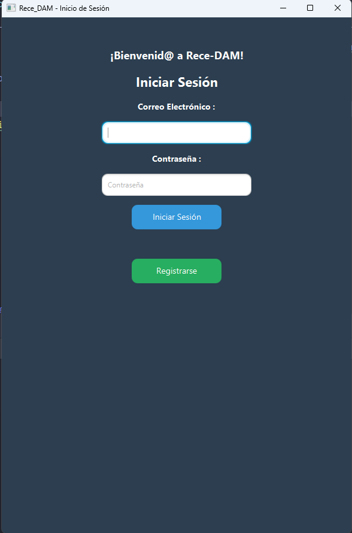
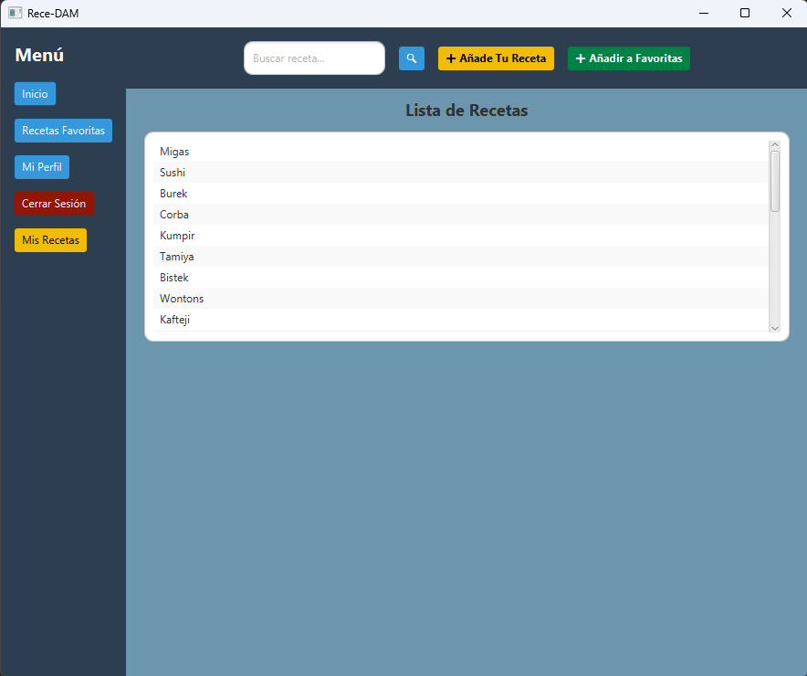
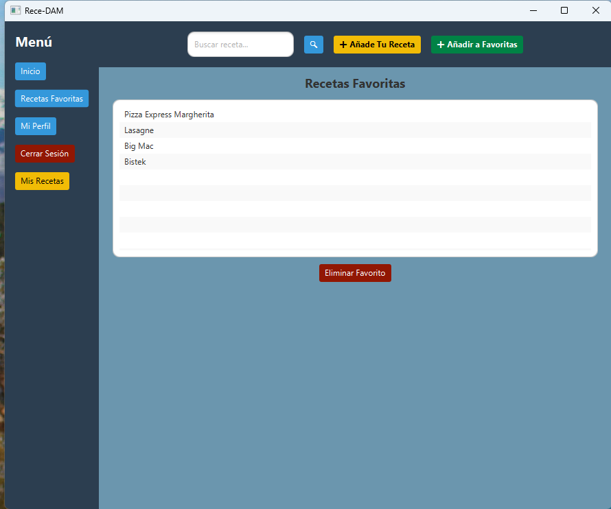

# 👨‍🍳🍽️ Proyecto RecetasAPIJavaFX

Este es un proyecto desarrollado en **Java** con la tecnología de **JavaFX**. Permite a los usuarios buscar, agregar y gestionar recetas de cocina. Utiliza una base de datos **MySQL** a través de **Hibernate** y se conecta con la API de **TheMealDB** para obtener recetas en línea.

---

## 📂 Estructura del Proyecto

```bash
ReceDAMJavaFX/
│── src/main/java/org/example/recedamjavafx/
│   ├── controllers/        # Controladores de la aplicación
│   ├── dao/                # Clases de acceso a la base de datos
│   ├── models/             # Modelos de datos
│   ├── utils/              # Utilidades y configuración de Hibernate
│── src/main/resources/
│   ├── fxml/               # Archivos de interfaz de usuario (JavaFX FXML)
│   ├── styles/             # Hojas de estilo CSS
│── database/               # Archivos relacionados con la base de datos
│── pom.xml                 # Archivo de configuración Maven
│── README.md               # Documentación del proyecto
```

---

## 🚀 Instalación y Configuración

### 1️⃣ Requisitos Previos

- **Java JDK 21 o superior**
- **IntelliJ IDEA o cualquier IDE compatible con Maven**
- **MySQL Server** instalado y configurado
- **DBeaver o MySQL Workbench** (Opcional, para administrar la base de datos más fácilmente)

---

### 2️⃣ Clonar el Repositorio

```sh
git clone https://github.com/sergiomarchado/ReceDAM_JavaFX.git
cd ReceDAM_JavaFX
```

---

### 3️⃣ Importar el Proyecto en IntelliJ IDEA

1. Abre **IntelliJ IDEA**
2. Selecciona **"Open"** y elige la carpeta del proyecto
3. IntelliJ detectará automáticamente que es un proyecto **Maven**. Si no lo hace, selecciona **"Import as Maven Project"**
4. Espera a que descargue las dependencias

---

### 4️⃣ Configurar la Base de Datos

#### 🔹 1️⃣ Iniciar el servidor de MySQL
- Asegúrate de que el servicio de **MySQL Server** esté corriendo. Puedes verificarlo desde **DBeaver**, **MySQL Workbench** o desde la terminal con:


#### 🔹 2️⃣ Importar la base de datos

- Abre **DBeaver** o **MySQL Workbench**
- Crea una base de datos nueva llamada **`proyecto_javafx`**
- Importa el archivo SQL que se encuentra en `database/proyecto_javafx.sql`

#### 🔹 3️⃣ Configurar Hibernate en IntelliJ IDEA

1. Abre la clase **`HibernateUtil.java`** dentro de `src/main/java/org/example/recedamjavafx/utils`
2. Modifica las credenciales de conexión con los datos de tu servidor MySQL:

```java
configuration.setProperty("hibernate.connection.url", "jdbc:mysql://localhost:3306/proyecto_javafx?useSSL=false&serverTimezone=UTC");
configuration.setProperty("hibernate.connection.username", "root"); // Reemplázalo con tu usuario
configuration.setProperty("hibernate.connection.password", "tu_contraseña"); // Reemplázalo con tu contraseña
```

---

### 5️⃣ Ejecutar la Aplicación

- En IntelliJ IDEA, abre `HelloApplication.java` y ejecútalo como **Java Application**
- O desde la terminal:

```sh
mvn clean javafx:run
```

---

## 🛠 Tecnologías Usadas

- ☕ **Java 21** - Lenguaje principal
- 🎨 **JavaFX** - Framework para la interfaz de usuario
- 🏢 **Hibernate** - ORM para la conexión con MySQL
- 📚 **Maven** - Gestión de dependencias
- 🔄 **Gson** - Parseo de datos JSON
- 🍽️ **TheMealDB API** - Fuente de datos de recetas

---

## 📌 Funcionalidades Principales

✅ **Búsqueda de recetas** usando la API de TheMealDB  
✅ **Autenticación de usuarios** con MySQL y Hibernate  
✅ **Añadir recetas a favoritos** y guardarlas en la base de datos  
✅ **Gestión de recetas personalizadas (CRUD)**  
✅ **Interfaz gráfica en JavaFX** con diseño moderno  

---

## 📸 Capturas de Pantalla

### 👤 Pantalla de Inicio de Sesión
Pantalla donde los usuarios pueden iniciar sesión con su cuenta registrada.


### 🏠 Pantalla Principal de Inicio
Pantalla de inicio donde se muestran las recetas obtenidas desde la API.


### ❤️ Recetas Favoritas
Vista de las recetas que el usuario ha marcado como favoritas.


### 🍽️👨‍🍳 Detalle de la Receta
Pantalla donde se muestran los detalles de una receta seleccionada.


---

